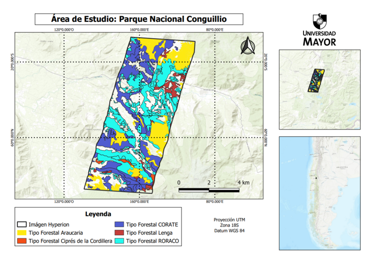
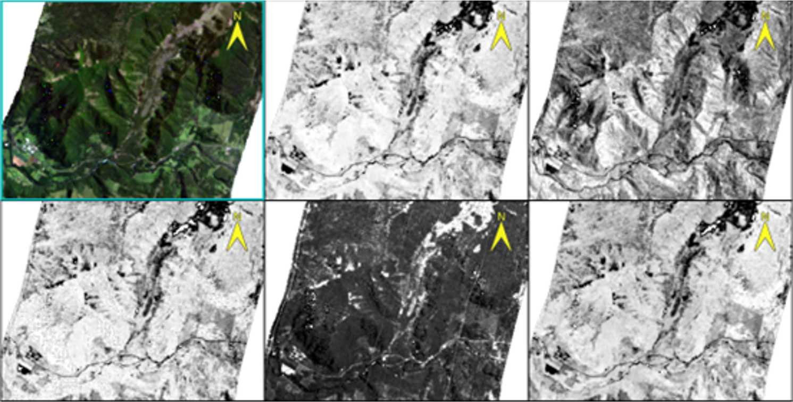

# Clasificación y Tipos de Vegetación - Parque Nacional Conguillío

**Herramienta:** ENVI

**Datos:** Imágenes hiperespectrales Hyperion

[Ver artículo completo](Clasificacion_tipos_vegetacion_Conguillio.pdf)

## Resumen

Diferenciación de firmas espectrales de especies forestales nativas (Araucaria araucana, Nothofagus spp., entre otras) y cálculo de índices de vegetación (NDVI, EVI, ARVI, SIPI, NDRE) en el Parque Nacional Conguillío, utilizando el Catastro de Recursos Vegetacionales de CONAF como referencia para la clasificación.

## Resultados

**Mapa del área de estudio: Parque Nacional Conguillío**

**Índices de Vegetación (NDVI, EVI, ARVI, SIPI, NDRE)**

