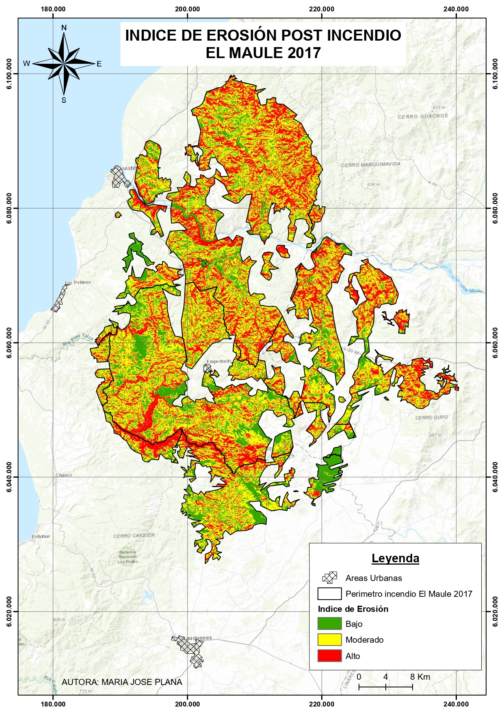
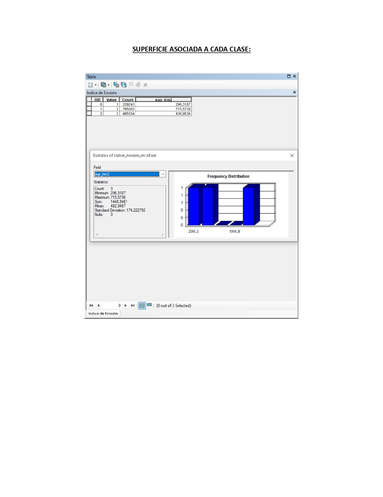

# Evaluación del riesgo de erosión post-incendio (Maule, 2017)

**Diplomado en Manejo de Información Espacial — Universidad Mayor (2023)**
Análisis multicriterio raster en **ArcGIS** para estimar el riesgo de erosión en la zona afectada por el Gran Incendio del Maule (2017) e identificar las áreas más vulnerables en torno a las zonas urbanas.

---

## Contexto

El ejercicio simula el encargo del Departamento de Medio Ambiente del Gobierno Regional del Maule: evaluar el riesgo de erosión del área quemada por el Gran Incendio del Maule de 2017 y reconocer las zonas más vulnerables, entendidas como las de mayor riesgo de erosión en el entorno de las áreas urbanas.

## Objetivos

- Estimar el **índice de erosión post-incendio** combinando variables topográficas, de proximidad, de suelo y de cobertura vegetal.
- Reclasificar el resultado en tres niveles de riesgo (Baja, Moderada, Alta).
- Cuantificar la superficie asociada a cada clase de riesgo e identificar las zonas vulnerables próximas a áreas urbanas.

## Área de estudio

Perímetro afectado por el **Gran Incendio del Maule (2017)**, Región del Maule.
<!-- Confirmar y completar: sistema de referencia (p. ej. UTM Huso 19S, WGS84) y superficie del área de estudio. -->

## Datos de entrada

| Capa | Uso en el análisis |
|------|--------------------|
| Modelo Digital de Elevación (DEM) | Pendiente y orientación |
| Perímetro de incendio | Recorte / máscara de análisis |
| Hidrografía | Distancia a la red de drenaje |
| Carreteras | Distancia a la red vial |
| Zonas urbanas | Identificación de zonas vulnerables |
| Catastro vegetacional (`CBN_monitoreo_2009.shp`) | Reclasificación por uso de suelo / vegetación |
| Tipo de suelo | Reclasificación por capacidad de uso |

El recorte se realiza al área del incendio y las capas vectoriales se rasterizan usando el **tamaño de píxel del DEM**.

## Metodología

### Reclasificación de cada variable

**Pendiente (grados)**

| Rango | Riesgo | Valor |
|-------|--------|-------|
| 0–10° | Muy bajo | 1 |
| 10–20° | Bajo | 2 |
| 20–30° | Moderado | 3 |
| 30–40° | Alto | 4 |
| >40° | Muy alto | 5 |

**Exposición (orientación de laderas)**

| Orientación | Valor |
|-------------|-------|
| N (0–67,5 / 292,5–360) | 5 |
| E (67,5–112,5) | 3 |
| W (247,5–292,5) | 2 |
| S (112,5–247,5) | 1 |

**Distancia a ríos (m)**: 0–25 = 5 · 25–50 = 4 · 50–75 = 3 · 75–150 = 2 · >150 = 1
**Distancia a carreteras (m)**: 0–25 = 5 · 25–100 = 3 · 100–150 = 2 · >150 = 1

**Capacidad de uso de suelo**

| Tipo | Valor |
|------|-------|
| NC, I, II, III | 1 |
| IV | 2 |
| V | 3 |
| VI | 4 |
| VII y VIII | 5 |

**Vegetación / uso de suelo** (las coberturas arbóreas reciben menor riesgo que las zonas sin vegetación o con vegetación dispersa)

| Uso de suelo | Valor |
|--------------|-------|
| Cuerpos de agua / Urbano / Otros | 0 |
| Bosque mixto denso / Bosque nativo cerrado | 1 |
| Bosque mixto abierto / Matorral denso / Plantación / Bosque nativo abierto | 2 |
| Matorral abierto | 3 |
| Praderas / Agrícola | 4 |

### Integración ponderada

```
Índice de Erosión = (0.30 · IE Pendiente) + (0.10 · IE Exposición)
                  + (0.10 · IE Dist. Caminos) + (0.10 · IE Dist. Ríos)
                  + (0.20 · IE Suelos) + (0.20 · IE Vegetación)
```

### Reclasificación final

| Índice | Riesgo |
|--------|--------|
| 1 – 2 | Baja |
| 2 – 2,5 | Moderada |
| >2,5 | Alta |

### Flujo de trabajo

```
Recorte al perímetro de incendio → Rasterización (píxel del DEM)
→ Reclasificación de variables → Índice de erosión ponderado
→ Reclasificación en 3 clases → Mapa final + superficie por clase
```

## Software y herramientas

**ArcGIS** — *Raster Calculator*, *Reclassify*, *Slope*, *Aspect*, *Euclidean Distance*, *Extract by Mask / Clip*, *Polygon to Raster*.

## Resultados


**Mapa de riesgo de erosión post-incendio**


**Superficie por clase de riesgo**



## Créditos

Laboratorio del Diplomado en Manejo de Información Espacial, Universidad Mayor (2023).
Profesoras: Idania Briceño y Paulina Vidal.
